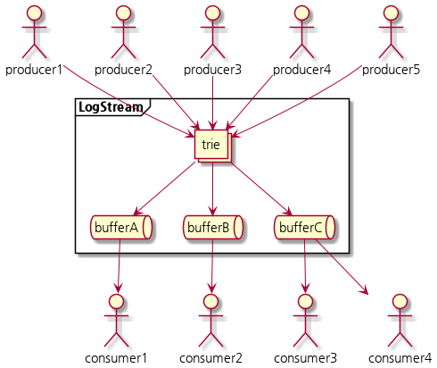

# logstream

logstream is simple library for logging

## install

`go get github.com/snowmerak/logstream/v2`

## diagram



## how to use

```go
package main

import (
	"context"
	"os"
	"os/signal"
	"time"

	"github.com/diy-cloud/logstream"
	"github.com/diy-cloud/logstream/consumer/stdout"
	"github.com/diy-cloud/logstream/log"
	"github.com/diy-cloud/logstream/log/loglevel"
)

func main() {
	// register topic into trie
	logstream.Trie.RegisterTopic("A")
	// register consumer into trie at specific topic
	// if there are several consumers in one topic, send log message to all consumers.
	logstream.Trie.RegisterConsumer("A", stdout.New(context.Background(), loglevel.Debug, nil))
	logstream.Trie.RegisterTopic("B")
	logstream.Trie.RegisterConsumer("B", stdout.New(context.Background(), loglevel.Error, nil))

	logstream.Write("A", log.New(0, loglevel.Debug, "A"))
	logstream.Write("B", log.New(0, loglevel.Debug, "B"))
	logstream.Write("A", log.New(0, loglevel.Info, "A"))
	logstream.Write("B", log.New(0, loglevel.Info, "B"))
	logstream.Write("A", log.New(0, loglevel.Warn, "A"))
	logstream.Write("B", log.New(0, loglevel.Warn, "B"))
	logstream.Write("A", log.New(0, loglevel.Error, "A", log.Rune("rune", '🐶')))
	logstream.Write("B", log.New(0, loglevel.Error, "B", log.Int64("int64", 1)))
	logstream.Write("A", log.New(0, loglevel.Fatal, "A", log.Bool("bool", true), log.Float64("float64", 1.1)))
	logstream.Write("B", log.New(0, loglevel.Fatal, "B", log.Duration("one hour", time.Hour), log.Duration("one minute", time.Minute)))

	sig := make(chan os.Signal, 1)
	signal.Notify(sig, os.Interrupt)
	<-sig
}
```

```bash
2022-02-07T15:58:53+09:00 [DEBUG] A ? 
2022-02-07T15:58:53+09:00 [INFO] A ? 
2022-02-07T15:58:53+09:00 [WARN] A ? 
2022-02-07T15:58:53+09:00 [ERROR] A ? rune='🐶' 
2022-02-07T15:58:53+09:00 [FATAL] A ? bool=true 
2022-02-07T15:58:53+09:00 [ERROR] B ? int64=1 
2022-02-07T15:58:53+09:00 [FATAL] B ? one hour=1h0m0s one minute=1m0s 
```
